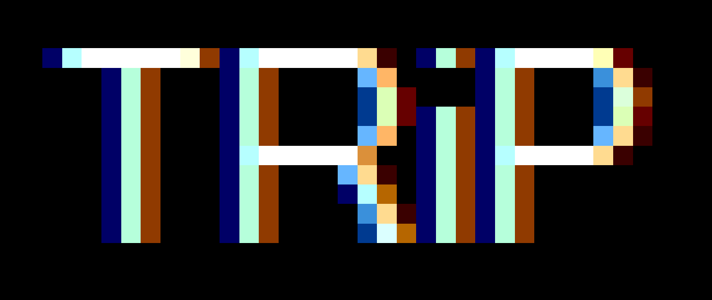
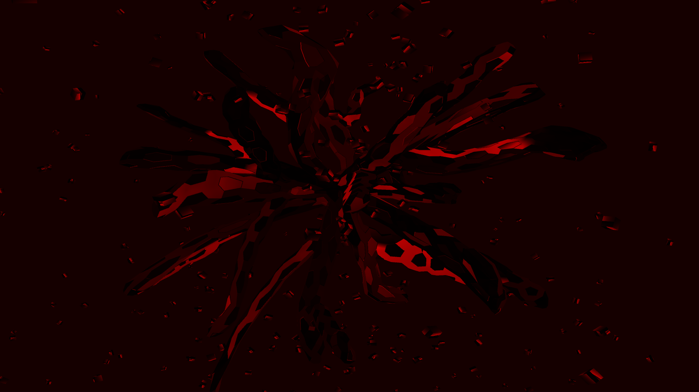
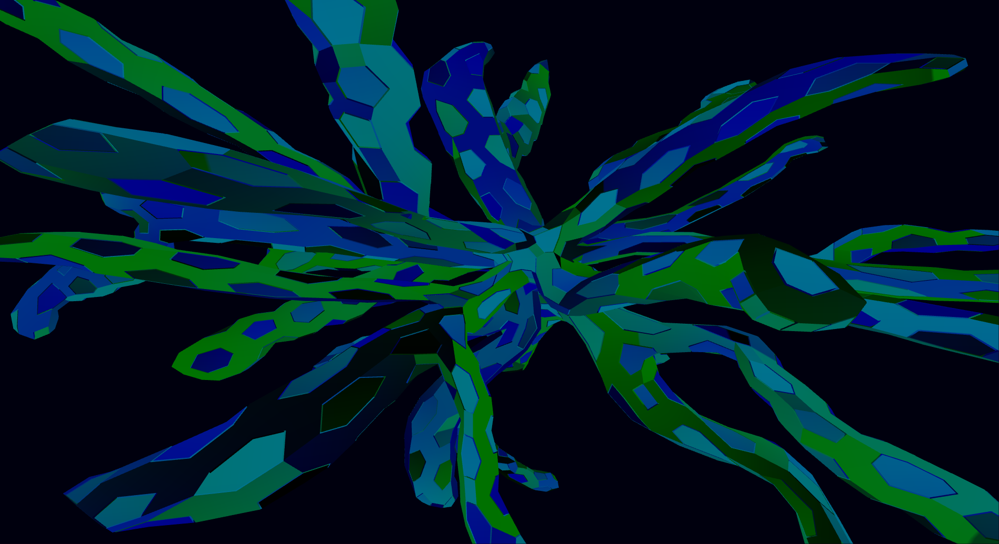
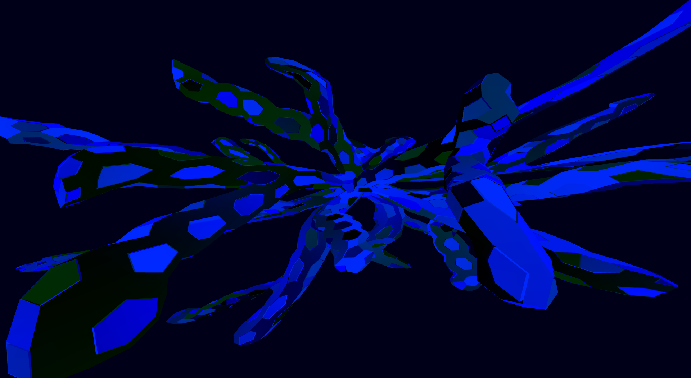

# TRiP
A proof of concept for a hyperflexible realtime abstract visualization & animation tool.

`TRiP` allows to interactively create and control a 3d scene via command line, the keyboard and
provides a programming interface to connect other input devices, like e.g. MIDI-devices.

`TRiP` decouples scene entities from transformations and provides means to attach/detach
transformations, materials and entities interactively. Furthermore, materials and transformations
can be influenced interactively with mathematical functions and timers, e.g. to fade in or fade out
animations.

Unfortunately, I stopped working on `TRiP` in favor of other projects.

**The project is not maintained anymore.**

## Screenshots
Screenshots taken from real time animations.
The screenshots depict a morphing and moving object or objects, with animated colors.
The scenes were created in real time using the builtin interpreter language.






## Prerequisites
`TRiP` is based on `OGRE 1.7` (https://www.ogre3d.org) and the `Object Oriented Input System`
(`OIS`) (https://github.com/wgois/OIS).
The project is written in `Visual Studio 2010`. I recommend to use `CMake` in future.


## Concepts
TODO

talk about:
- Compositors
- Nomenclature
- Functions
- Transformers
- Clusters
- Solids
- Controllers
- and the rest


## Usage
TODO

### Configuration Files
TODO

### Interactive Input
TODO

#### Interactive Console Interpreter Language
TODO

#### Keyboard Input
TODO

The keyboard input interpreter language may come in different versions:
```
# Standard version
: enable
: add solid <solidname>
solid <solidname>: add transformer <transformername>
solid <solidname>::transformer <transformername>: fade in 1000 <fadefunctionname>
solid <solidname>:: transformer <transformername>: up
solid <solidname>: add random transformer
solid <solidname>:: transformer <transformername2>: enable
solid <solidname>:: transformer <transformername2>: up
solid <solidname>: enable
solid <solidname>: root
: add random solid
solid <solidname2>: add random transformer
solid <solidname2>:: transformer <transformername3>: fade in 1400
solid <solidname2>:: transformer <transformername3>: up
solid <solidname2>: enable
solid <solidname2>: up
: disable

# Short version
: e
: add s <solidname>
solid <solidname>: add t <transformername>
solid <solidname>::transformer <transformername>: fin 1000 <fadefunctionname>
solid <solidname>:: transformer <transformername>: up
solid <solidname>: add rnd t
solid <solidname>:: transformer <transformername2>: e
solid <solidname>:: transformer <transformername2>: up
solid <solidname>: e
solid <solidname>: r
: add rnd s
solid <solidname2>: add rnd t
solid <solidname2>:: transformer <transformername3>: fin 1400
solid <solidname2>:: transformer <transformername3>: up
solid <solidname2>: e
solid <solidname2>: up
: d

# Hypershort version
: e
: as <solidname>
s <solidname>: at <transformername>
s <solidname>::t <transformername>: fin 1000 <fadefunctionname>
<solidname>::t <transformername>: .
s <solidname>: art
s <solidname>::t <transformername2>: e
s <solidname>::t <transformername2>: .
s <solidname>: e
s <solidname>: ..
: ars
s <solidname2>: art
s <solidname2>::t <transformername3>: fin 1400
s <solidname2>::t <transformername3>: .
s <solidname2>: e
s <solidname2>: .
: <solidname2>
s <solidname2>: r
: d
```


#### Adding New Input Sources
TODO


## TODO
- set enabled for Clusters shall do something meaningful
- use more references
- Script Parser
- Get Stats
- MouseFrameListener
- change keyboard mapping
- release-elements for the functions
- build a dtor for `TripVarManager`
- refac `KeyboardInputListener` überarbeiten
- Background color
- cout fps
- cout stats
- Switch between meshes / Materials
- Camera controls: Switch between centric rotation and fps-mode
- Recompile shader programs
- jump camera to selected entity
- think about Backstring System
- Keep ERRORPRONE in mind
- use external keyboard interpreter framework, something that supports inputl abbreviations like vim
  does with vimscript
- fill `README.md`

### Geometry batching
```cpp
//Load a mesh to read data from.
        InstancedGeometry* batch = mSceneMgr->createInstancedGeometry(meshes[mSelectedMesh] + "s" );
        batch->setCastShadows(true);

        batch->setBatchInstanceDimensions (Vector3(1000000, 1000000, 1000000));
        const size_t batchSize = (mNumMeshes > maxObjectsPerBatch) ? maxObjectsPerBatch :mNumMeshes;
        setupInstancedMaterialToEntity(ent);
        for(size_t i = 0; i < batchSize ; i++)
        {
            batch->addEntity(ent, Vector3::ZERO);
        }
        batch->setOrigin(Vector3::ZERO);

        batch->build();
// END Geometry Batching
```


### get names of compositors
```cpp
// gets the names of all compositors
auto iteral = Ogre::CompositorManager::getSingleton().getResourceIterator();
    for( auto it = iteral.begin();
        it != iteral.end(); it++)
    {
        std::cout << it->first << "\t" << it->second->getName() << std::endl;
    }
